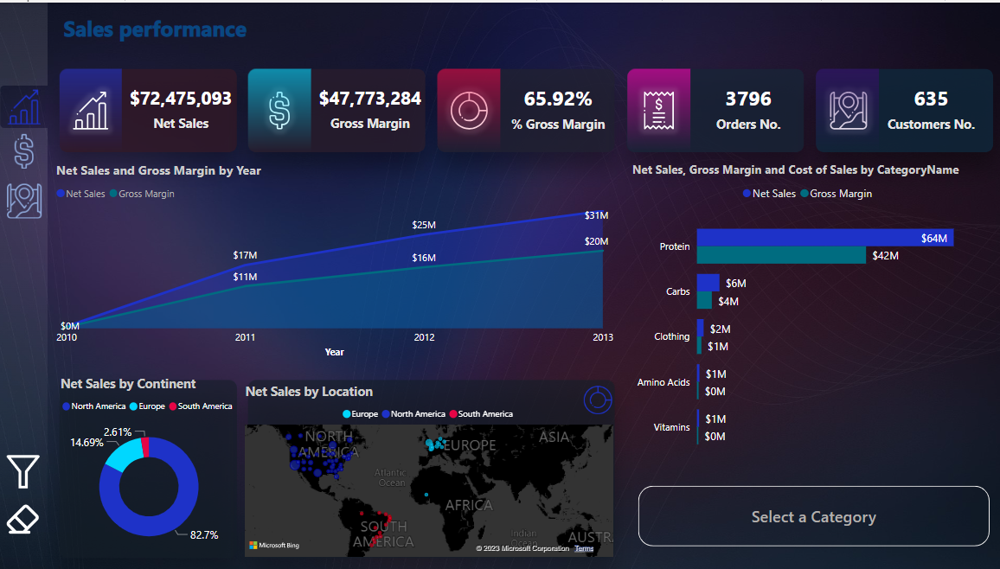
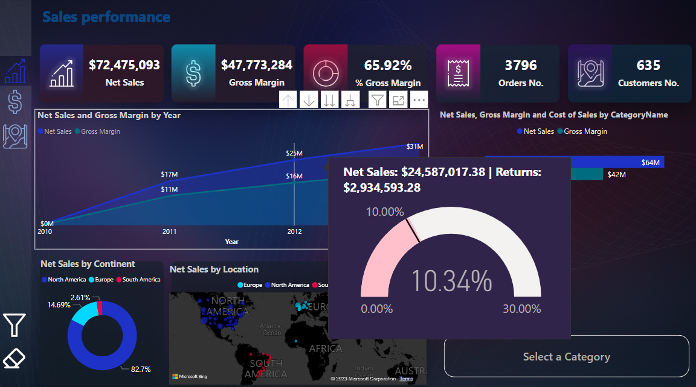

# Power_BI_in_Sales_Analysis
Power_BI_in_Sales_Analysis 

## Introduction
This project is to display Sales Analysis using POWER BI. The problem satatement is an imaginary case scenario I thought about after seeing the dataset.

## Problem Statement
A Sales director in an international company in the United States wishes to have a dynamic report clarify the Net Sales and gross margin up to date.

After discussion with him I noticed that he want a dynamic report which answer four main questions:
1. How is Sales Performance going over years.
2. Compare Gross Margin Year over Year.
3. How Many Customers Purchase two different product together.

That's inspire me to create three main dashboards and one detailed dashboard:

1- Sales Performance.
2- Gross Margin YOY.
3- Customers Cross selling
4- Order Detais

## Data Sourcing
 the information was seperated into differnt sheets or tables resulting into 5 tables:
- Customers
- Products
- Date
- Returns
- Sales

Data was then locally extracted from Excel Workbook into Power BI for transformation, analysis and visualization.

## Data Transformation

Data Transformation was performed to can easily apply star schema.
Data cleaning was performed per table.
The table appeared to be clean.
The quality of each column is 100% with no error or nulls.
Below is a preview of the tables:

Customers Table             |           Products Table
:--------------------------:|:------------------------:
         |         

Date Table              |               Returns Table
:---------------------------:|:----------------------
                |     

**Sales Table**

For the Returns and Sales Tables, first rows were not headers and so resolved that by applying the "Use First row as header" action.
Sales Tables was used to extract Dimension tables (Customers & Products)
column datatypes were validated appropriately , also removed unnecessary columns.

## Data Model Design
The data required for this analysis are located in various tables.
Therfore, appropriate modelling is required.
A star Schema is designed with the Sales and Returns Table representing the fact table containing all redundant data, and to which other dimension tables are modelled or connected to, using the column that is common. Date Table was created in power query using list of max and min date from sales tables
Sales & Rturns Table has been modelled with:
- Date Table using the "Date"
- Product Table using "Productkey"
- Customers Tables via "CustomerKey"
- Date Tables via "Date"

## Data Aanalysis/ Visualization
Analysis was done using simple visuals since the tables have been perfectly modelled together.
Applied some Dax Function to get the required information

## Sales performance

#### Sales performance is improving since 2010 till 2013 years.
#### Protein is the best sales contributes about 64 million to net sales compared with Carps 6 million 

2012 Returns             |          2013 Returns
:--------------------------:|:------------------------:
         |         

####  Focus on 2013 vs 2012 we can easily find that:
 - Net Sales goes up to $31M compared with $25M in 2012.
 - Gross Margin goes up to $20M compared with $16M in 2012.
 - Sales return improved in 2013 (6.46%) by about 3.5% below return margin allowed (10%) comparing with 2012 (10.34%) by about 0.34% over return margin allowed.

We can then Right click on "Category Order details
Here I Check Protein Order details.

## Gross Margin Year over Year
This dashboard clear the Gross margin:
 1- Year over year by month.
 2- Year to date comparing same period last year.
 3- Year over year by Category and subcategory.

 Here I filtered on 2013 comapring by 2012
 
 

 #### Gross Margin is $20M in 2013 compared with $16M in 2012 by about 27%.
 #### Clearly find that 2013 follows same trend on 2012 with growing in gross margin except on May and August trend goes up on 2013 while it was down on 2012.
 #### Unfortenatly Jackets gross margin and Vests decreased by (100%, 93%) respectively in 2013 comapring by 2012.

 
## Customers Cross Selling and Customers Purchase

Obective : Number of customers whose purchased two product together.

#### Focus on Aminox Bcaa we can find that only 5 customers purchase this product and all of then had bought Pro Weight Gainer with it

## Conclusions/Recommendations
- Over all sales performance is doing will since 2010 till 2013.
- Studying How can increase categories sales by making Promotion offer when buying from protein category.
- Studying the cross selling of Aminox Bcaa and other products especially Pro Weight Gainer and make Promotion offers on Aminox Bcaa.
------

###### My goal is to provide value to the stakeholders and not just to build reports and dashboard. 

Thank you.

